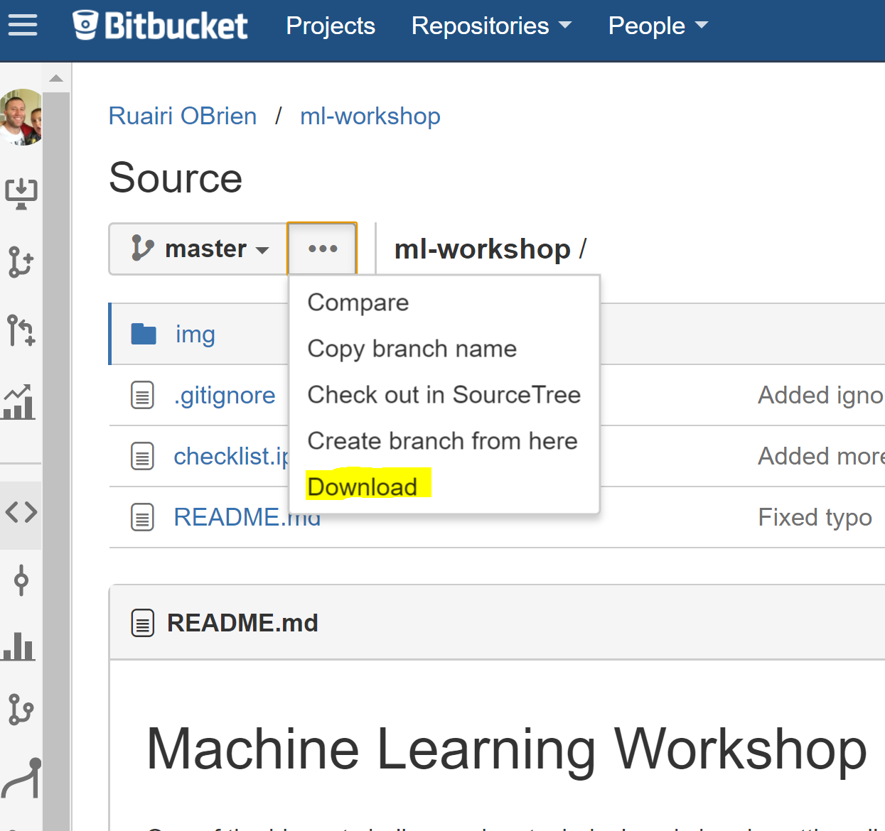
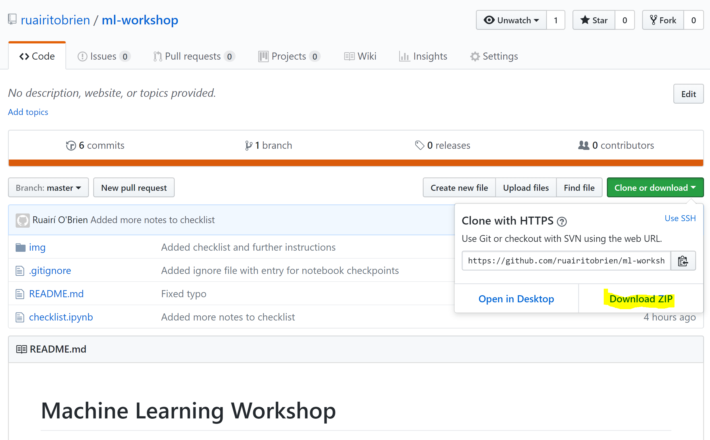
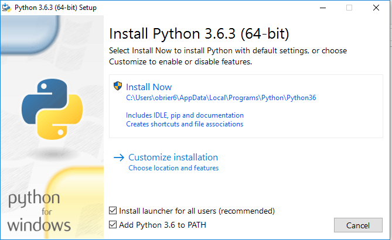
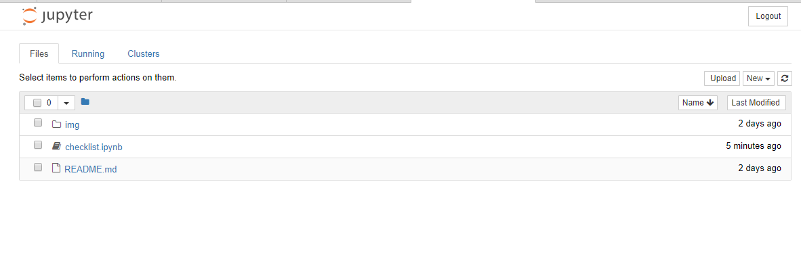
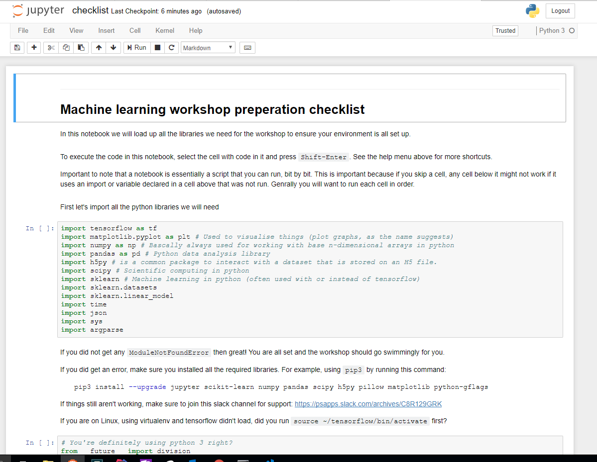

Machine Learning Workshop
=========================

One of the biggest challenges in a technical workshop is getting all the development environments setup to a point where we can all follow along.

This document will attempt to provide enough information to make sure you can set everything up before the actual workshop. 

For this workshop we will be using [Python](https://www.python.org/) and [Tensorflow](https://www.tensorflow.org/).

Ideally we would use [Pytorch](http://pytorch.org/) but this is [not currently supported on Windows](https://github.com/pytorch/pytorch/issues/494) and due to the high usage of Windows in this group, we will go with Tensorflow, which is also an amazing framework. 

## Download this 

If you are familiar with the [git](https://git-scm.com/) version control system, then please clone this repository.

If not, then you can download this to your machine using the download link provided. 

If you are viewing this in bitbucket, that will be here:



If you are viewing on github, it will be here:



## Support

For support during the setup proccess, please join this slack channel: https://psapps.slack.com/archives/C8R129GRK

## Setup instructions

For the instructions here, I am trying to keep it simple and will install things from scratch, step by step. 

### 1. Install Python

#### Linux or OSX

If you are on Linux or OSX, try to ensure you are using Python 3 or, even better, skip to the 'Install Tensorflow' step and install with virtualenv!

#### Windows

For Windows, install this: https://www.python.org/downloads/release/python-363/

You can download the installer from here (assuming everyone has 64 bit windows at this stage): https://www.python.org/ftp/python/3.6.3/python-3.6.3-amd64.exe

Just do the default installation but also select 'Add Python to Path' to save you having to do it yourself. 



Crack open a fresh terminal (not one you had open before installing Python).

The following assumes you are using the good old `cmd` [terminal on Windows](https://en.wikipedia.org/wiki/Cmd.exe). Going with this as it's the one we can be sure everybody has.

If you use Powershell, this should all work too. If you are using bash for windows, you are probably better off looking at the Ubuntu installation of Tensorflow. I haven't tried this though so you will be on your own with that. 

Type `python`

You should see something like:

```
Python 3.6.3 (v3.6.3:2c5fed8, Oct  3 2017, 18:11:49) [MSC v.1900 64 bit (AMD64)] on win32
Type "help", "copyright", "credits" or "license" for more information.
>>>
```

You're in the [Interactive Python Interpreter](https://docs.python.org/3/tutorial/interpreter.html).

Type `exit()` to leave Python. 


### 2. Install Tensorflow

There are really good instructions on how to proceed here: https://www.tensorflow.org/install

I recommend you install the CPU Only version. 

##### What I did:

To support what will most likely be the most troublesome setup, I will be using Windows for the workshop. What follows are exactly the steps I took to install Tensorflow. I am using the Windows `cmd` [terminal](https://en.wikipedia.org/wiki/Cmd.exe).


Once you have installed Python in step 1, you will have a program called `pip3` now available in your terminal. To install Tensorflow run `pip3 install --upgrade tensorflow`

For me that looked like this:

```
C:\Users\obrier6>pip3 install --upgrade tensorflow
Collecting tensorflow
  Downloading tensorflow-1.4.0-cp36-cp36m-win_amd64.whl (28.3MB)
    100% |████████████████████████████████| 28.3MB 39kB/s
Collecting wheel>=0.26 (from tensorflow)
  Downloading wheel-0.30.0-py2.py3-none-any.whl (49kB)
    100% |████████████████████████████████| 51kB 2.8MB/s
Collecting enum34>=1.1.6 (from tensorflow)
  Downloading enum34-1.1.6-py3-none-any.whl
Collecting protobuf>=3.3.0 (from tensorflow)
  Downloading protobuf-3.5.1-py2.py3-none-any.whl (388kB)
    100% |████████████████████████████████| 389kB 488kB/s
Collecting six>=1.10.0 (from tensorflow)
  Downloading six-1.11.0-py2.py3-none-any.whl
Collecting tensorflow-tensorboard<0.5.0,>=0.4.0rc1 (from tensorflow)
  Downloading tensorflow_tensorboard-0.4.0rc3-py3-none-any.whl (1.7MB)
    100% |████████████████████████████████| 1.7MB 387kB/s
Collecting numpy>=1.12.1 (from tensorflow)
  Downloading numpy-1.14.0-cp36-none-win_amd64.whl (13.4MB)
    100% |████████████████████████████████| 13.4MB 77kB/s
Collecting setuptools (from protobuf>=3.3.0->tensorflow)
  Downloading setuptools-38.4.0-py2.py3-none-any.whl (489kB)
    100% |████████████████████████████████| 491kB 628kB/s
Collecting markdown>=2.6.8 (from tensorflow-tensorboard<0.5.0,>=0.4.0rc1->tensorflow)
  Downloading Markdown-2.6.11-py2.py3-none-any.whl (78kB)
    100% |████████████████████████████████| 81kB 534kB/s
Collecting html5lib==0.9999999 (from tensorflow-tensorboard<0.5.0,>=0.4.0rc1->tensorflow)
  Downloading html5lib-0.9999999.tar.gz (889kB)
    100% |████████████████████████████████| 890kB 391kB/s
Collecting werkzeug>=0.11.10 (from tensorflow-tensorboard<0.5.0,>=0.4.0rc1->tensorflow)
  Downloading Werkzeug-0.14.1-py2.py3-none-any.whl (322kB)
    100% |████████████████████████████████| 327kB 530kB/s
Collecting bleach==1.5.0 (from tensorflow-tensorboard<0.5.0,>=0.4.0rc1->tensorflow)
  Downloading bleach-1.5.0-py2.py3-none-any.whl
Installing collected packages: wheel, enum34, setuptools, six, protobuf, markdown, html5lib, numpy, werkzeug, bleach, tensorflow-tensorboard, tensorflow
  Found existing installation: setuptools 28.8.0
    Uninstalling setuptools-28.8.0:
      Successfully uninstalled setuptools-28.8.0
  Running setup.py install for html5lib ... done
Successfully installed bleach-1.5.0 enum34-1.1.6 html5lib-0.9999999 markdown-2.6.11 numpy-1.14.0 protobuf-3.5.1 setuptools-38.4.0 six-1.11.0 tensorflow-1.4.0 tensorflow-tensorboard-0.4.0rc3 werkzeug-0.14.1 wheel-0.30.0
```


Validating the install:

```
C:\Users\obrier6>python
Python 3.6.3 (v3.6.3:2c5fed8, Oct  3 2017, 18:11:49) [MSC v.1900 64 bit (AMD64)] on win32
Type "help", "copyright", "credits" or "license" for more information.
>>> import tensorflow as tf
>>> hello = tf.constant('Hello, TensorFlow!')
>>> sess = tf.Session()
2018-01-10 18:22:52.062777: I C:\tf_jenkins\home\workspace\rel-win\M\windows\PY\36\tensorflow\core\platform\cpu_feature_guard.cc:137] Your CPU supports instructions that this TensorFlow binary was not compiled to use: AVX AVX2
>>> print(sess.run(hello))
b'Hello, TensorFlow!
```

You may have noticed this warning:
> 2018-01-10 18:22:52.062777: I C:\tf_jenkins\home\workspace\rel-win\M\windows\PY\36\tensorflow\core\platform\cpu_feature_guard.cc:137] Your CPU supports instructions that this TensorFlow binary was not compiled to use: AVX AVX2

Don't worry about it. It could be a problem when building a production system where performance is important but for this workshop it's not a problem.


### 3. Install jupyter

We will use [Jupyter](https://jupyter.org/) to run our code in 'notebooks'. Notebooks allow you to essentially write and run code in a browser through an application being served locally. You can mix markdown, to document what you are doing, with runnable python code that you execute right there in the notebook. It's a really great tool. While you could keep your code in normal python scripts and build your ML applications like any normal application, in my experience, most ML applicaions begin as a notebook and only become 'real applications/services' if there's a very good reason for it. 

The installation instructons [on the jupyter site](https://jupyter.org/install) are very straight forward. 

This is what I did: 

*Important: if you installed using virtualenv, be sure to activate it with `source ~/tensorflow/bin/activate` and your prompt looks like `(tensorflow)$` before running `pip3` as virtualenv installs dependencies to its own isolated environnment*

`pip3 install jupyter`

Verifing the install:

`jupyter notebook`

This should open a browser window that will list any files in the directory you ran the command from.

### 4. Install a bunch of libraries

We will use a few python libraries in this workshop. To be able to import them in to your scripts and notebooks, you need to install them. If you used Anaconda, then these are probably already installed but if not, use pip to install them by copying and running this command:

*Important: if you installed using virtualenv, be sure to activate it with `source ~/tensorflow/bin/activate` and your prompt looks like `(tensorflow)$` before running `pip3` as virtualenv installs dependencies to its own isolated environnment*

```
pip3 install --upgrade scikit-learn numpy pandas scipy h5py pillow matplotlib python-gflags ipython
```

### 5. Run the checklist notebook

In your command line terminal, make sure you are in the root of this repository. So if you dowloaded this repository to a folder called 'Dev' in your home folder `cd %userprofile%\Dev\ml-workshop` (on Windows) or `cd ~\Dev\ml-workshop`. 

Run jupyter notebook

`jupyter notebook`

If you're using virtualenv: `(tensorflow)$ jupyter notebook`

A browser window listing the contents of the repository should be visible.



Click in to checklist.ipynb and follow the instructions there.




You should be all set now. See you at the workshop!
